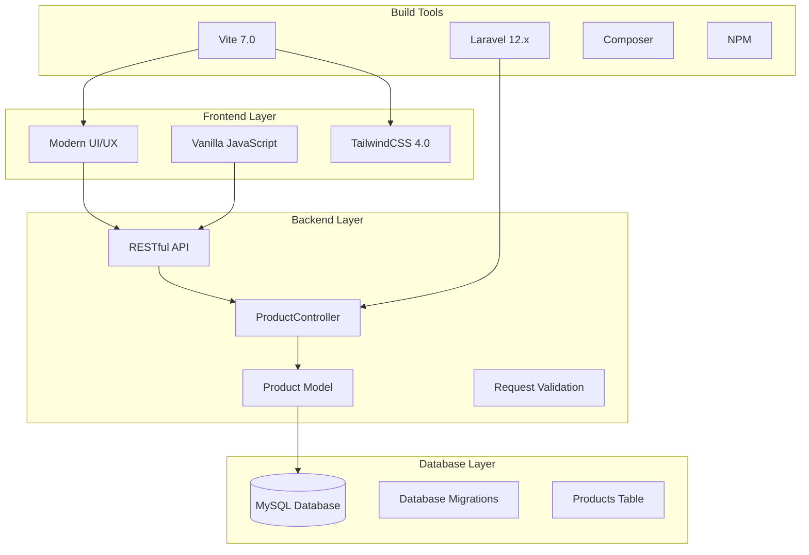
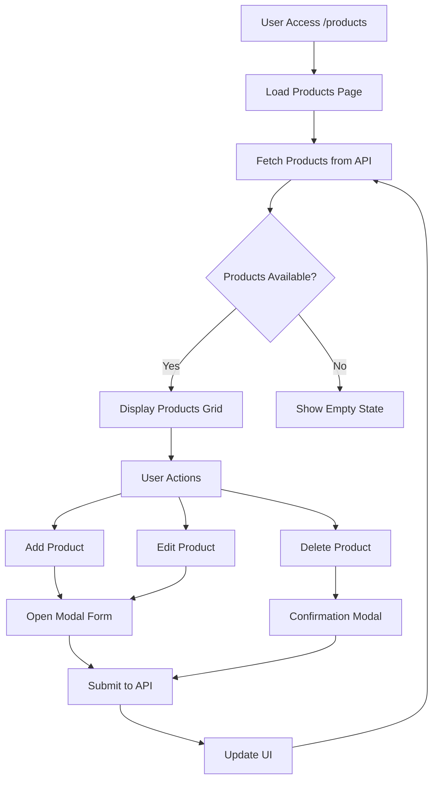
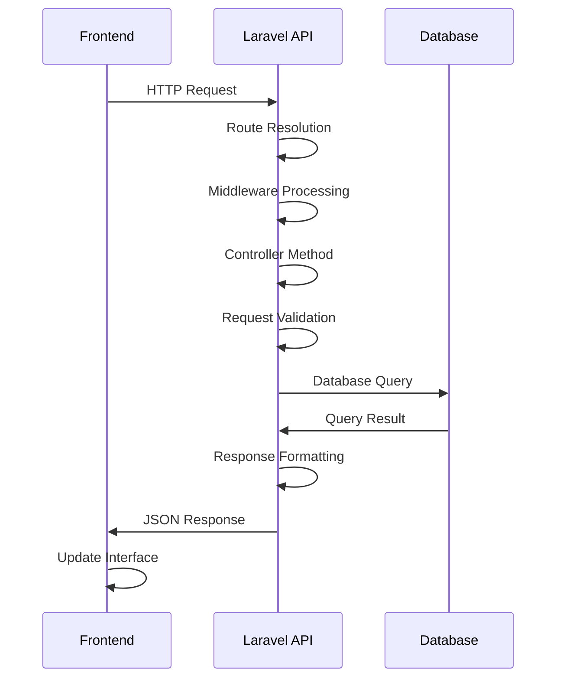

# 🚀 JHIC Sistem Manajemen Produk

<p align="center">
  
</p>

<p align="center">
  <strong>Proyek Tugas Bootcamp JHIC (Jagoan Hosting Infra Competition)</strong><br>
  Sistem Manajemen Produk berbasis Laravel dengan UI/UX Modern
</p>

<p align="center">
  
  
  
  
</p>

---

## 📋 Daftar Isi

- [🎯 Tujuan Proyek](#-tujuan-proyek)
- [🏗️ Arsitektur Sistem](#️-arsitektur-sistem)
- [🛠️ Tech Stack](#️-tech-stack)
- [📊 Skema Database](#-skema-database)
- [🔄 Alur Aplikasi](#-alur-aplikasi)
- [✅ Progress Implementasi](#-progress-implementasi)
- [🚧 Fitur yang Belum Diimplementasikan](#-fitur-yang-belum-diimplementasikan)
- [🚀 Quick Start](#-quick-start)
- [👥 Panduan Kontribusi Tim](#-panduan-kontribusi-tim)
- [📁 Struktur Proyek](#-struktur-proyek)
- [🔗 Dokumentasi API](#-dokumentasi-api)

---

## 🎯 Tujuan Proyek

Proyek ini dibuat sebagai bagian dari **Bootcamp JHIC (Jagoan Hosting Infra Competition)** dengan tujuan:

### 🎯 **Untuk Dewan Juri:**
- ✅ Memudahkan pengecekan progress tugas
- ✅ Memberikan gambaran lengkap tentang arsitektur dan flow aplikasi
- ✅ Mendemonstrasikan implementasi best practices Laravel

### 👥 **Untuk Tim Developer:**
- ✅ Mempermudah kolaborasi dan kontribusi anggota tim
- ✅ Standardisasi development workflow
- ✅ Dokumentasi lengkap untuk onboarding
- ✅ Code structure yang maintainable

---

## 🏗️ Arsitektur Sistem



### 🔧 **Arsitektur Pattern:**
- **MVC (Model-View-Controller)** - Separation of concerns
- **RESTful API** - Standardized HTTP methods
- **Single Page Application (SPA)** - Dynamic content loading
- **Component-Based UI** - Reusable modal components

---

## 🛠️ Tech Stack

### 🖥️ **Backend:**
| Technology | Version | Purpose |
|------------|---------|---------|
| **PHP** | 8.2+ | Server-side language |
| **Laravel** | 12.x | Web framework |
| **MySQL** | 8.0+ | Database |
| **Composer** | Latest | Dependency management |

### 🎨 **Frontend:**
| Technology | Version | Purpose |
|------------|---------|---------|
| **HTML5** | Latest | Markup structure |
| **TailwindCSS** | 4.0 | Utility-first CSS framework |
| **Vanilla JavaScript** | ES6+ | Client-side interactivity |
| **Vite** | 7.0 | Build tool & dev server |

### 🔧 **Development Tools:**
| Tool | Purpose |
|------|---------|
| **Laravel Artisan** | Command-line interface |
| **Laravel Tinker** | REPL for Laravel |
| **Pest** | Testing framework |
| **Laravel Pint** | Code style fixer |
| **Concurrently** | Run multiple commands |

---

## 📊 Skema Database

### 📦 **Products Table:**
```sql
CREATE TABLE products (
    id BIGINT PRIMARY KEY AUTO_INCREMENT,
    name VARCHAR(255) NOT NULL,
    description TEXT NULL,
    price DECIMAL(10,2) NOT NULL,
    stock INTEGER DEFAULT 0,
    category VARCHAR(255) NULL,
    is_active BOOLEAN DEFAULT TRUE,
    created_at TIMESTAMP NULL,
    updated_at TIMESTAMP NULL
);
```

### 🔍 **Field Descriptions:**
| Field | Type | Description | Validation |
|-------|------|-------------|------------|
| `id` | BIGINT | Primary key | Auto increment |
| `name` | VARCHAR(255) | Product name | Required, max 255 chars |
| `description` | TEXT | Product description | Optional |
| `price` | DECIMAL(10,2) | Product price | Required, min 0 |
| `stock` | INTEGER | Stock quantity | Required, min 0 |
| `category` | VARCHAR(255) | Product category | Optional |
| `is_active` | BOOLEAN | Product status | Default true |
| `created_at` | TIMESTAMP | Creation time | Auto-generated |
| `updated_at` | TIMESTAMP | Last update time | Auto-generated |

### 🌱 **Database Seeder:**

#### **ProductSeeder** - Sample Data Generator
Seeder ini menggunakan **Faker** untuk menghasilkan 200 data produk realistis dengan karakteristik:

**📋 Data yang Dihasilkan:**
- **Nama Produk:** Kombinasi kategori + nama produk (contoh: "Laptop Gaming ASUS ROG")
- **Deskripsi:** Deskripsi detail produk dalam bahasa Indonesia
- **Harga:** Range Rp 10.000 - Rp 50.000.000 (sesuai kategori)
- **Stok:** 0-100 unit (dengan 10% kemungkinan out of stock)
- **Kategori:** 8 kategori utama (Elektronik, Fashion, Makanan, dll.)
- **Status:** 95% aktif, 5% non-aktif

**🎯 Kategori Produk:**
| Kategori | Contoh Produk | Range Harga |
|----------|---------------|-------------|
| Elektronik | Laptop, Smartphone, TV | Rp 500K - 50M |
| Fashion | Baju, Sepatu, Tas | Rp 50K - 2M |
| Makanan | Snack, Minuman, Frozen | Rp 10K - 500K |
| Kesehatan | Vitamin, Obat, Suplemen | Rp 25K - 1M |
| Olahraga | Sepatu Lari, Bola, Raket | Rp 100K - 5M |
| Buku | Novel, Textbook, Komik | Rp 15K - 300K |
| Mainan | Action Figure, Board Game | Rp 50K - 1M |
| Rumah Tangga | Peralatan Dapur, Furniture | Rp 25K - 10M |

**⚡ Cara Menjalankan:**
```bash
# Jalankan seeder khusus ProductSeeder
php artisan db:seed --class=ProductSeeder

# Atau jalankan semua seeders
php artisan db:seed

# Reset database dan jalankan ulang seeder
php artisan migrate:fresh --seed
```

**✅ Verifikasi Data:**
```bash
# Cek jumlah data di database
php artisan tinker
>>> App\Models\Product::count()
>>> App\Models\Product::take(5)->get()
```

---

## 🔄 Alur Aplikasi

### 📱 **User Interface Flow:**


### 🔌 **API Request Flow:**


---

## ✅ Progress Implementasi

### 🎯 **Fitur yang Sudah Selesai:**

#### 🖥️ **Backend (100% Selesai):**
- ✅ **Model Product** - Model Eloquent dengan fillable fields
- ✅ **Migrasi Database** - Struktur tabel products
- ✅ **ProductController** - Operasi CRUD lengkap
- ✅ **Route API** - Endpoint RESTful
- ✅ **Validasi Request** - Validasi input yang komprehensif
- ✅ **Penanganan Error** - Exception handling yang tepat
- ✅ **Response JSON** - Response API yang terstandarisasi

#### 🎨 **Frontend (95% Selesai):**
- ✅ **Desain UI Modern** - Interface yang bersih dan responsif
- ✅ **Tampilan Grid Produk** - Layout berbasis card
- ✅ **Komponen Modal** - Modal untuk Add/Edit/Delete
- ✅ **Penanganan Form** - Pengiriman form yang dinamis
- ✅ **Update Real-time** - Update UI secara instan
- ✅ **Loading States** - Feedback pengguna selama operasi
- ✅ **Penanganan Error** - Pesan error yang user-friendly
- ✅ **Empty States** - Panduan ketika tidak ada data
- ✅ **Status Koneksi** - Indikator konektivitas API
- ✅ **Desain Responsif** - Layout yang mobile-friendly

#### 🔧 **Setup Development (100% Selesai):**
- ✅ **Laravel 12.x** - Versi framework terbaru
- ✅ **Konfigurasi Vite** - Setup build tool modern
- ✅ **TailwindCSS 4.0** - Framework CSS terbaru
- ✅ **Script Development** - Workflow dev otomatis
- ✅ **Setup Database** - Konfigurasi MySQL
- ✅ **Konfigurasi Environment** - Setup .env

### 📊 **API Endpoints yang Diimplementasikan:**
| Method | Endpoint | Deskripsi | Status |
|--------|----------|-------------|--------|
| `GET` | `/api/products` | Ambil semua produk | ✅ Selesai |
| `POST` | `/api/products` | Buat produk baru | ✅ Selesai |
| `GET` | `/api/products/{id}` | Ambil produk tertentu | ✅ Selesai |
| `PUT/PATCH` | `/api/products/{id}` | Update produk | ✅ Selesai |
| `DELETE` | `/api/products/{id}` | Hapus produk | ✅ Selesai |

---

## 🚧 Fitur yang Belum Diimplementasikan

### 🔍 **Fungsionalitas Pencarian (Prioritas: Tinggi)**
- **Frontend:** Field input pencarian dan logika filter
- **Backend:** Penanganan query parameter untuk pencarian
- **Fitur:** Pencarian berdasarkan nama, deskripsi, kategori
- **Implementasi:** Query WHERE LIKE dengan pagination

### 📄 **Sistem Pagination (Prioritas: Tinggi)**
- **Frontend:** Kontrol pagination dan navigasi
- **Backend:** Laravel pagination dengan limit/offset
- **Fitur:** Pemilihan ukuran halaman, navigasi halaman
- **Implementasi:** Pagination bawaan Laravel

---

## 🚀 Quick Start

### 📋 **Prerequisites:**
- PHP 8.2 atau lebih tinggi
- Composer
- Node.js & NPM
- MySQL 8.0+ atau XAMPP/Laragon (sudah include MySQL)

### ⚡ **Installation Steps:**

```bash
# 1. Fork & Clone repository
git clone https://github.com/rafapradana/jhic.git
cd jhic

# 2. Install PHP dependencies
composer install

# 3. Install Node.js dependencies
npm install

# 4. Setup environment
cp .env.example .env
php artisan key:generate

# 5. Setup database (MySQL)
# Buat database 'jhic' di MySQL
# Update .env file dengan kredensial MySQL
php artisan migrate

# 6. Seed database dengan sample data (opsional)
php artisan db:seed --class=ProductSeeder
# Atau jalankan semua seeders:
# php artisan db:seed

# 7. Start development servers
npm run dev
```

### 🌐 **Access Application:**
- **Web Interface:** http://localhost:8000/products
- **API Base URL:** http://localhost:8000/api
- **Development Server:** Runs on port 8000

---

## 👥 Panduan Kontribusi Tim Developer

### 🚀 **Setup Environment (XAMPP/Laragon)**

#### 📦 **Option 1: Menggunakan XAMPP**

1. **Download & Install XAMPP:**
   ```
   Download: https://www.apachefriends.org/download.html
   - Pilih versi PHP 8.2+
   - Install Apache, MySQL, PHP
   ```

2. **Start Services:**
   - Buka XAMPP Control Panel
   - Start Apache dan MySQL
   - Pastikan port 80 (Apache) dan 3306 (MySQL) tidak bentrok

3. **Setup Database:**
   ```
   - Buka http://localhost/phpmyadmin
   - Create database baru: 'jhic'
   - Charset: utf8mb4_unicode_ci
   ```

#### 🔧 **Option 2: Menggunakan Laragon (Recommended)**

1. **Download & Install Laragon:**
   ```
   Download: https://laragon.org/download/
   - Pilih Laragon Full (sudah include PHP 8.2+, MySQL, Node.js)
   - Install dengan default settings
   ```

2. **Start Laragon:**
   - Klik "Start All" di Laragon
   - Pastikan semua services berjalan (hijau)

3. **Setup Database:**
   ```
   - Klik "Database" di Laragon
   - Atau buka http://localhost/phpmyadmin
   - Create database: 'jhic'
   ```

### 🔄 **Fork-Based Contribution Workflow**

#### 🍴 **Step 1: Fork Repository**

1. **Fork di GitHub:**
   ```
   - Buka: https://github.com/rafapradana/jhic
   - Klik tombol "Fork" di kanan atas
   - Fork ke akun GitHub pribadi
   ```

2. **Clone Fork ke Local:**
   ```bash
   # Clone repository fork Anda
   git clone https://github.com/[USERNAME-ANDA]/jhic.git
   cd jhic
   
   # Tambahkan upstream remote
   git remote add upstream https://github.com/rafapradana/jhic.git
   
   # Verifikasi remote
   git remote -v
   ```

#### ⚙️ **Step 2: Setup Project Local**

1. **Install Dependencies:**
   ```bash
   # Install PHP dependencies
   composer install
   
   # Install Node.js dependencies
   npm install
   ```

2. **Environment Configuration:**
   ```bash
   # Copy environment file
   copy .env.example .env
   
   # Generate application key
   php artisan key:generate
   ```

3. **Database Configuration (.env):**
   ```env
   DB_CONNECTION=mysql
   DB_HOST=127.0.0.1
   DB_PORT=3306
   DB_DATABASE=jhic
   DB_USERNAME=root
   DB_PASSWORD=
   ```

4. **Run Migrations:**
   ```bash
   php artisan migrate
   ```

5. **Start Development Server:**
   ```bash
   # Terminal 1: Laravel server
   php artisan serve
   
   # Terminal 2: Vite dev server
   npm run dev
   ```

#### 🌿 **Step 3: Feature Development Workflow**

1. **Sync dengan Upstream:**
   ```bash
   # Fetch latest changes dari upstream
   git fetch upstream
   
   # Switch ke main branch
   git checkout main
   
   # Merge changes dari upstream
   git merge upstream/main
   
   # Push ke fork Anda
   git push origin main
   ```

2. **Create Feature Branch:**
   ```bash
   # Buat branch baru untuk fitur
   git checkout -b feature/nama-fitur-anda
   
   # Contoh:
   git checkout -b feature/search-functionality
   git checkout -b feature/pagination-system
   git checkout -b fix/modal-overlay-issue
   ```

3. **Development Process:**
   ```bash
   # Lakukan perubahan code
   # Test fitur yang dibuat
   
   # Add changes
   git add .
   
   # Commit dengan pesan yang jelas
   git commit -m "feat: add search functionality with filters"
   
   # Push ke fork repository
   git push origin feature/nama-fitur-anda
   ```

#### 📤 **Step 4: Submit Pull Request**

1. **Create Pull Request:**
   ```
   - Buka GitHub fork repository Anda
   - Klik "Compare & pull request"
   - Base repository: rafapradana/jhic
   - Base branch: main
   - Head repository: [username-anda]/jhic
   - Compare branch: feature/nama-fitur-anda
   ```

2. **PR Template:**
   ```markdown
   ## 📋 Deskripsi
   Brief description of changes
   
   ## ✅ Checklist
   - [ ] Code tested locally
   - [ ] No console errors
   - [ ] Responsive design maintained
   - [ ] Follows coding standards
   
   ## 📸 Screenshots (jika ada perubahan UI)
   [Attach screenshots]
   
   ## 🧪 Testing Steps
   1. Step 1
   2. Step 2
   3. Step 3
   ```

3. **Review Process:**
   - Tunggu review 
   - Address feedback jika ada
   - Update PR sesuai saran
   - Merge setelah approved

### 📝 **Coding Standards & Best Practices**

#### 🖥️ **Backend (Laravel):**
```php
// ✅ Good
class ProductController extends Controller
{
    public function store(Request $request)
    {
        $validated = $request->validate([
            'name' => 'required|string|max:255',
            'price' => 'required|numeric|min:0',
        ]);
        
        $product = Product::create($validated);
        
        return response()->json([
            'success' => true,
            'message' => 'Product created successfully',
            'data' => $product
        ]);
    }
}
```

#### 🎨 **Frontend (JavaScript + TailwindCSS):**
```javascript
// ✅ Good
function createProduct(productData) {
    return fetch('/api/products', {
        method: 'POST',
        headers: {
            'Content-Type': 'application/json',
            'X-CSRF-TOKEN': document.querySelector('meta[name="csrf-token"]').content
        },
        body: JSON.stringify(productData)
    })
    .then(response => response.json())
    .catch(error => {
        console.error('Error creating product:', error);
        throw error;
    });
}
```

#### 🎯 **Commit Message Convention:**
```bash
# Format: type(scope): description

feat: add search functionality
fix: resolve modal overlay issue
docs: update README installation guide
style: improve responsive design
refactor: optimize API response structure
test: add unit tests for ProductController
```

### 🧪 **Testing Guidelines**

#### 🔍 **Manual Testing:**
```bash
# 1. Test di browser
http://localhost:8000/products

# 2. Test API endpoints
# GET /api/products
# POST /api/products
# PUT /api/products/{id}
# DELETE /api/products/{id}

# 3. Test responsive design
# Desktop, tablet, mobile views
```

#### ⚡ **Automated Testing:**
```bash
# Run all tests
php artisan test

# Run specific test file, contoh:
php artisan test tests/Feature/ProductTest.php

# Run with coverage
php artisan test --coverage
```

#### 🚀 **Pengujian API Endpoint (Script CLI):**
```bash
# Test semua API endpoints dengan script CLI custom
php artisan api:test

# Test dengan custom host/URL
php artisan api:test --host=http://localhost:8000

# Test dengan host production
php artisan api:test --host=https://your-domain.com
```

**🎯 Fitur CLI Testing Script:**
- ✅ **Pengujian Komprehensif** - Test semua operasi CRUD (GET, POST, PUT, DELETE)
- ✅ **Output yang Indah** - Interface informatif dengan emoji dan progress bar
- ✅ **Pengujian Validasi** - Test error handling dan validation rules
- ✅ **Pengujian 404** - Test response untuk resource yang tidak ditemukan
- ✅ **Metrik Performa** - Menampilkan response time untuk setiap request
- ✅ **Ringkasan Detail** - Laporan lengkap dengan statistik dan rekomendasi
- ✅ **Pemeriksaan Kesehatan Server** - Verifikasi koneksi server sebelum testing
- ✅ **Output Bahasa Indonesia** - Interface dalam bahasa Indonesia
- ✅ **Status Penjelasan Real-time** - Penjelasan status selama proses testing

**📊 Cakupan Test:**
1. **GET /api/products** - Mengambil semua produk
2. **POST /api/products** - Membuat produk baru
3. **GET /api/products/{id}** - Mengambil produk tertentu
4. **PUT /api/products/{id}** - Mengupdate produk
5. **DELETE /api/products/{id}** - Menghapus produk
6. **GET /api/products/999999** - Test 404 untuk produk yang tidak ada
7. **POST /api/products** - Test validasi dengan data tidak valid (status 422)

**📈 Contoh Output:**
```
----------------------------------------------------------------
🚀 JHIC API ENDPOINT TESTER
Pengujian & Validasi API Komprehensif
----------------------------------------------------------------

🌐 Base URL: http://127.0.0.1:8000
📅 Waktu Test: 2025-01-01 12:00:00

🔄 Memeriksa koneksi server...
✅ Server berjalan dan dapat diakses

🔄 Memulai test...

🔄 Menjalankan test: GET /api/products - Mengambil semua produk
   ✅ Berhasil mengambil 15 produk
   ⏱️  Durasi: 381.83ms

🔄 Menjalankan test: POST /api/products - Membuat produk baru
   ✅ Berhasil membuat produk dengan ID: 16
   ⏱️  Durasi: 345.01ms

----------------------------------------------------------------
TEST SUMMARY
----------------------------------------------------------------

📊 Statistik Test:
   ✅ Berhasil: 7
   ❌ Gagal: 0
   📊 Tingkat Keberhasilan: 100%

💡 Rekomendasi & Analisis:
   🎉 Sempurna! Semua endpoint API berfungsi dengan baik.
   🚀 API Anda siap untuk digunakan di production.

----------------------------------------------------------------
🎉 Testing API Selesai!
Terima kasih telah menggunakan JHIC API Tester
----------------------------------------------------------------
```

### 🚨 **Common Issues & Solutions**

#### 🔧 **Database Connection Issues:**
```bash
# Error: SQLSTATE[HY000] [2002]
# Solution: Pastikan MySQL service running di XAMPP/Laragon

# Error: Access denied for user 'root'
# Solution: Check DB_PASSWORD di .env file
```

#### 🌐 **Port Conflicts:**
```bash
# Laravel default: http://localhost:8000
# Jika port 8000 digunakan:
php artisan serve --port=8001

# Vite default: http://localhost:5173
# Check vite.config.js untuk custom port
```

#### 📦 **Dependency Issues:**
```bash
# Clear cache
php artisan cache:clear
php artisan config:clear
php artisan route:clear

# Reinstall dependencies
rm -rf vendor node_modules
composer install
npm install
```

---

## 📁 Struktur Proyek

```
jhic/
├── 📁 app/
│   ├── 📁 Http/Controllers/
│   │   └── 📄 ProductController.php     # CRUD operations
│   └── 📁 Models/
│       └── 📄 Product.php               # Product model
├── 📁 database/
│   ├── 📁 migrations/
│   │   └── 📄 create_products_table.php # Database schema
│   └── 📁 seeders/                      # Database seeders
├── 📁 resources/
│   ├── 📁 css/
│   │   └── 📄 app.css                   # TailwindCSS styles
│   ├── 📁 js/
│   │   └── 📄 app.js                    # Frontend logic
│   └── 📁 views/
│       └── 📄 products.blade.php        # Main UI
├── 📁 routes/
│   ├── 📄 api.php                       # API routes
│   └── 📄 web.php                       # Web routes
├── 📄 composer.json                     # PHP dependencies
├── 📄 package.json                      # Node.js dependencies
├── 📄 vite.config.js                    # Build configuration
└── 📄 README.md                         # This file
```

---

## 🔗 Dokumentasi API

### 📊 **Response Format:**
```json
{
  "success": true,
  "message": "Operation successful",
  "data": {...},
  "total": 10
}
```

### 🔍 **GET /api/products**
**Description:** Retrieve all products

**Response:**
```json
{
  "success": true,
  "message": "Products retrieved successfully",
  "total": 2,
  "data": [
    {
      "id": 1,
      "name": "Product Name",
      "description": "Product description",
      "price": "99.99",
      "stock": 10,
      "category": "Electronics",
      "is_active": true,
      "created_at": "2024-01-01T00:00:00.000000Z",
      "updated_at": "2024-01-01T00:00:00.000000Z"
    }
  ]
}
```

### ➕ **POST /api/products**
**Description:** Create new product

**Request Body:**
```json
{
  "name": "Product Name",
  "description": "Product description",
  "price": 99.99,
  "stock": 10,
  "status": "active"
}
```

### ✏️ **PUT /api/products/{id}**
**Description:** Update existing product

**Request Body:** Same as POST (all fields optional)

### 🗑️ **DELETE /api/products/{id}**
**Description:** Delete product

**Response:**
```json
{
  "success": true,
  "message": "Product 'Product Name' deleted successfully"
}
```

---


<p align="center">
  <strong>🏆 JHIC Bootcamp Project 2025</strong><br>
  Built with ❤️ using Laravel
</p>

---

**Last Updated:** 1 Oktober 2025  
**Version:** 1.0.0  
**Status:** In Development
